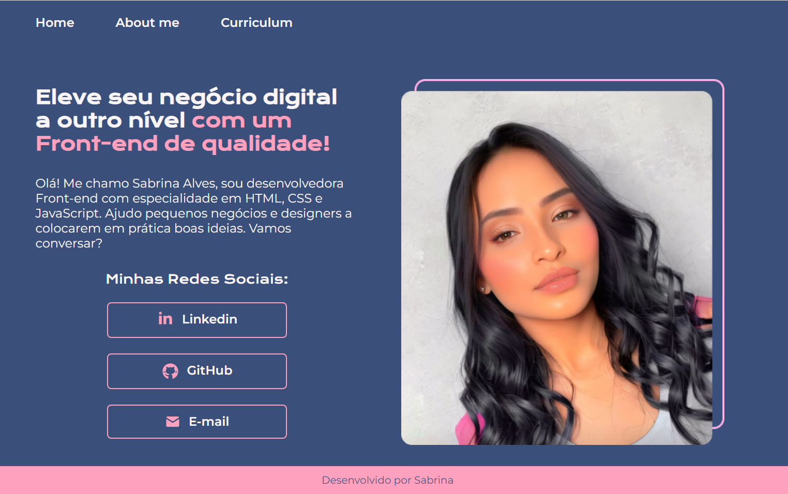

<h1 align="center">Portfolio</h1>

Projeto desenvolvido através do curso de HTML e CSS da Alura 

---

 

## 🚀 Techs e Infos

As seguintes tecnologia foram usadas na construção desse projeto:

- `HTML`
- `CSS`

Cores: 
- Fundo: #3a4f7a;
- Destaque: #fea1bf;
- Texto: #f9f5f6;

## Developer

<a href="#">
 
  
 <b></b></a> 
 
Feito com 💜 por Sabrina Alves

 
 
  

